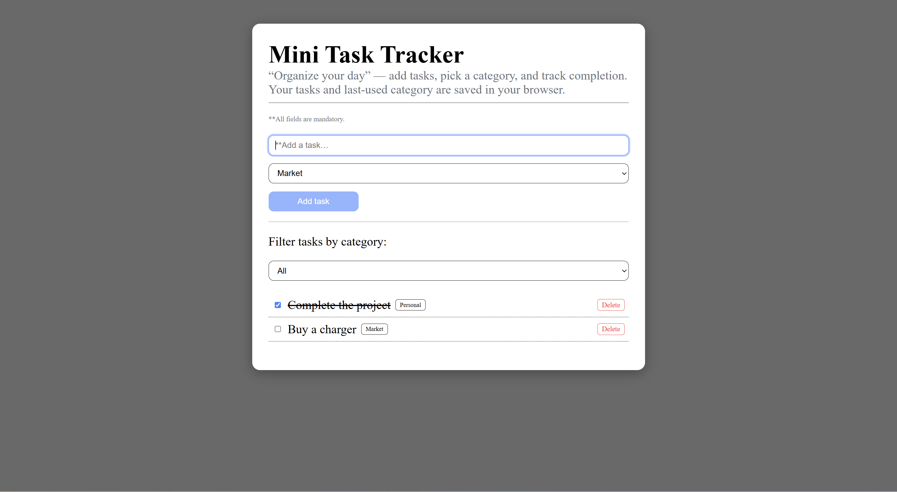

# "Organize your day" - mini task tracker

A lightweight React app that helps you organize your daily tasks by category — featuring persistent storage, accessible form validation, and a clean responsive design.

---

## React + Vite

This template provides a minimal setup to get React working in Vite.

---

## Setup

## 1) Clone the project
git clone https://github.com/AmitSaha93/organize-your-day.git

## 2) Install deps
npm install

## 3) Start the dev server
npm run dev
## -> http://localhost:5173/

## 4) Run tests in watch mode
npm run test

## 5) To deploy directly to gitHub
npm run deploy

---

## Available Scripts

1) npm run dev          # Run the app in development
2) npm run build        # Production build (in /build)
3) npm run test         # Run tests in watch mode
4) test:coverage        # Run tests with coverage

---

## Screenshots

| Desktop View |

| Mobile View |

---

## In the project

1. Add Task: input for title, dropdown for category, add button.
2. Task List: display tasks with title, category, checkbox for completion.
3. Filtering: filter by category.
4. Persistence: save tasks in localStorage.
5. UX Details: refocus input and remember last used category.
6. Testing: include at least one unit test verifying adding a task updates the list.
7. Delete task: There is a delete button for each task that you added to delete that task.

---

